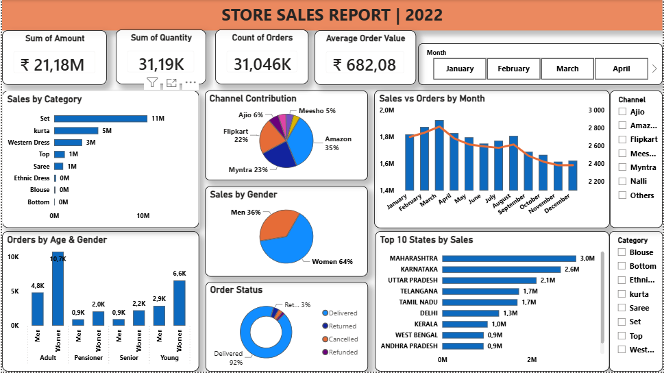

#  Store Sales Analysis
##  Project Overview

This project analyzes store sales data to identify sales trends,
customer purchasing behaviour, sales performance, and business
opportunities.

## 📂 Data Source

**Source:** Kaggle  
**Dataset:** Vrinda Store Sales 
**Link:** [Download here](https://www.kaggle.com/datasets/amitkumar209/vrinda-store-sales-data)

## 🛠️ Tools Used

SQL   Excel  Power BI

## 🎯 Business Questions

1. What are the total sales and orders?
2. Which category generates the most sales?
3. Which gender contributes the most sales?
4. Which age group generates the most sales?
5. Which month has the highest sales?
6. Which channels generate the most orders?
7. Show different orders status?
8. Which states generate the most sales?

## 🧹 Data Cleaning - SQL Queries

- Removing duplicates
- Checking missing values
- Standardizing & Formatting dates
- Checking incorrect values

## 🗃️ SQL Analysis

SQL was used to perform:

- Data cleaning 
- Total sales and orders analysis
- Sales by gender analysis
- Show different order status
- Sales channel analysis
- Sales by state analysis
- Sales by category analysis- 
- Sales by age group analysis

[View SQL Queries](SQL_Store_Sales_Analysis.sql)

## 📊 Dashboard

The Power BI dashboard contains:

### KPI Cards

- Total Sales
- Total Orders
- Total Quantity Sold
- Average Order Value

### Visualizations

- Monthly Sales Trend
- Sales by Category
- Sales by Gender
- Sales by State
- Sales by Sales Channel
- Top 10 Products
- Order Status

### Filters

- Month
- Channel
- Category

## 🔍 Key Insights

- Women generated a significant portion of total sales 64%.
- Adult age group (30-49) contributed a larger proportion sales.
- Set, kurta & western dress categories contributed 88 % sales.
- Q1 recorded the highest quarterly sales.
- The top 3 performing states are Maharashtra, Karnataka, Uttar Pradesh.
- Amazon, Myntra & Flipkart channels outperformed others by 80 %.

## 💡Recommendations

- Target women customers of age group (30-49) living in
  Maharashtra, Karnataka, Uttar Pradesh.
- Strengthen Amazon, Myntra & Flipkart channels by ads/offers/coupons available.
- Increase inventory and staffing in December to maximize Q1 sales. 
- Investigate low-performing states for growth opportunities.
